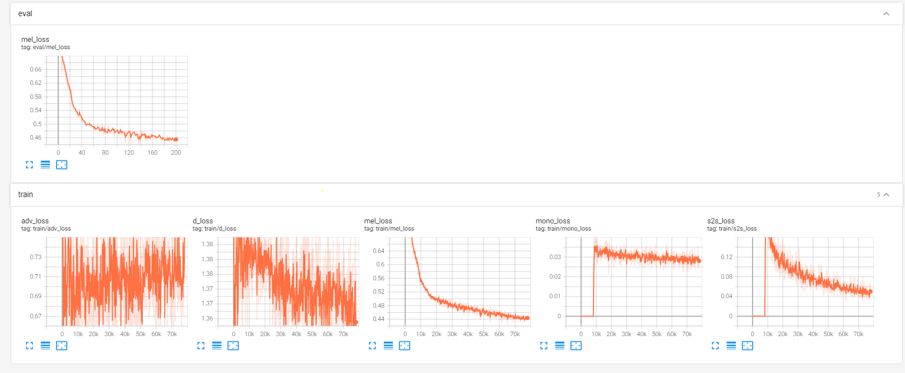

# StyleTTS: A Style-Based Generative Model for Natural and Diverse Text-to-Speech Synthesis

### Yinghao Aaron Li, Cong Han, Nima Mesgarani

> Text-to-Speech (TTS) has recently seen great progress in synthesizing high-quality speech owing to the rapid development of parallel TTS systems, but producing speech with naturalistic prosodic variations, speaking styles, and emotional tones remains challenging. Moreover, since duration and speech are generated separately, parallel TTS models still have problems finding the best monotonic alignments that are crucial for naturalistic speech synthesis. Here, we propose StyleTTS, a style-based generative model for parallel TTS that can synthesize diverse speech with natural prosody from a reference speech utterance. With novel Transferable Monotonic Aligner (TMA) and duration-invariant data augmentation schemes, our method significantly outperforms state-of-the-art models on both single and multi-speaker datasets in subjective tests of speech naturalness and speaker similarity. Through self-supervised learning of the speaking styles, our model can synthesize speech with the same prosodic and emotional tone as any given reference speech without the need for explicitly labeling these categories.

Paper: [https://arxiv.org/abs/2107.10394](https://arxiv.org/abs/2205.15439)

Audio samples: [https://styletts.github.io/](https://styletts.github.io/)

## Pre-requisites
1. Python >= 3.7
2. Clone this repository:
```bash
git clone https://github.com/yl4579/StyleTTS.git
cd StyleTTS
```
3. Install python requirements: 
```bash
pip install SoundFile torchaudio munch torch pydub pyyaml librosa git+https://github.com/resemble-ai/monotonic_align.git
```
4. Download and extract the [LJSpeech dataset](https://keithito.com/LJ-Speech-Dataset/), unzip to the data folder, and upsample the data to 24 kHz. The vocoder, text aligner, and pitch extractor are pre-trained on 24 kHz data, but you can easily change the preprocessing and re-train them using your own preprocessing. I will provide more recipes and pre-trained models later if I have time. If you are willing to help, feel free to work on other preprocessing methods. 
For LibriTTS, you will need to combine train-clean-360 with train-clean-100 and rename the folder train-clean-460 (see [val_list_libritts.txt](https://github.com/yl4579/StyleTTS/blob/main/Data/val_list_libritts.txt) as an example).

## Training
First stage training:
```bash
python train_first.py --config_path ./Configs/config.yml
```
Second stage training:
```bash
python train_second.py --config_path ./Configs/config.yml
```
You can run both consecutively and it will train both the first and second stages. The model will be saved in the format "epoch_1st_%05d.pth" and "epoch_2nd_%05d.pth". Checkpoints and Tensorboard logs will be saved at `log_dir`. 

The data list format needs to be `filename.wav|transcription`, see [val_list_libritts.txt](https://github.com/yl4579/StyleTTS/blob/main/Data/val_list_libritts.txt) as an example. 

## Inference

Please refer to [inference.ipynb](https://github.com/yl4579/StyleTTS/blob/main/Demo/Inference_LJSpeech.ipynb) for details. 

The trained StyleTTS and Hifi-GAN on LJSpeech corpus in 24 kHz can be downloaded at [StyleTTS Link](https://drive.google.com/file/d/1aqOExU7NroGHdIVjgkzqRYrK5q_694cj/view?usp=sharing) and [Hifi-GAN Link](https://drive.google.com/file/d/1h_h0GFdC6VOiZ-oFDClqy2bVonA1xDiw/view?usp=sharing). 

The pretrained StyleTTS and Hifi-GAN on LibriTTS corpus can be downloaded at [StyleTTS Link](https://drive.google.com/file/d/1nm0yB6Y5QWF3FYGfJCwQ6zYNlOAYVSet/view?usp=sharing) and [Hifi-GAN Link](https://drive.google.com/file/d/1RDxYknrzncGzusYeVeDo38ErNdczzbik/view?usp=sharing). You also need to download test-clean from LibriTTS if you want to run the zero-shot demo. 

Please unzip `Models` and `Vocoder` respectively and run each cell in the notebook. You will also need to install [phonemizer](https://github.com/bootphon/phonemizer) to run this inference demo. 

## Training Log
The whole training process uses 4 stages.

### Train text-alignment
You need to use your language word_dicts, you can see an example [here](https://github.com/VTCA-HYPER-LEARNING/StyleTTS/blob/master/AuxiliaryASR/word_index_dict_3.txt), it is currently using the IPA code, you can just it suitable with you or convert all your dataset to IPA

Evaluation


Training


### Training Pitch Extractor
Pitch Extractor: In [meldataset.py](https://github.com/yl4579/PitchExtractor/blob/main/meldataset.py), the F0 curves are computed using [PyWorld](https://pypi.org/project/pyworld/), one with `harvest` and another with `dio`. Both methods are acoustic-based and are unstable under certain conditions. `harvest` is faster but fails more than `dio`, so we first try `harvest`. When `harvest` fails (determined by a number of frames with non-zero values), it will compute the ground truth F0 labels with dio. If `dio` fails, the computed F0 will have `NaN` and will be replaced with 0. This is supposed to occur only occasionally and should not affect training because these samples are treated as noises by the neural network and deep learning models are known to even benefit from slightly noisy datasets. However, if a lot of your samples have this problem (say > 5%), please remove them from the training set so that the model does not learn from the failed samples.


Evaluation


Training


### Train Stage 1:


Log





### Train Stage 2:


Log:


## Preprocessing
You can open another instruction [here](https://github.com/VTCA-HYPER-LEARNING/StyleTTS/blob/master/preprocessing/README.MD)

The trained text aligner and pitch extractor models are provided under the `Utils` folder. Both the text aligner and pitch extractor models are trained with Mel spectrograms preprocessed using [meldataset.py](https://github.com/yl4579/StyleTTS/blob/main/meldataset.py). 

You can edit the [meldataset.py](https://github.com/yl4579/StyleTTS/blob/main/meldataset.py) with your own Mel spectrogram preprocessing, but the provided pre-trained models will no longer work. You will need to train your own text aligner and pitch extractor with the new preprocessing. 

The code for training the new text aligner model is available [here](https://github.com/yl4579/AuxiliaryASR) and that for training new pitch extractor models is available [here](https://github.com/yl4579/PitchExtractor).

I will provide more recipes with existing preprocessing like those in the official [HifiGAN](https://github.com/jik876/hifi-gan) and [ESPNet](https://github.com/espnet/espnet) in the future if I have extra time. If you are willing to help, feel free to make recipes with [ESPNet](https://github.com/espnet/espnet). 
